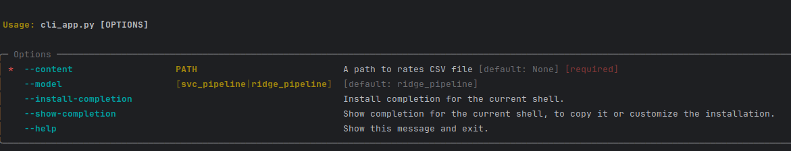
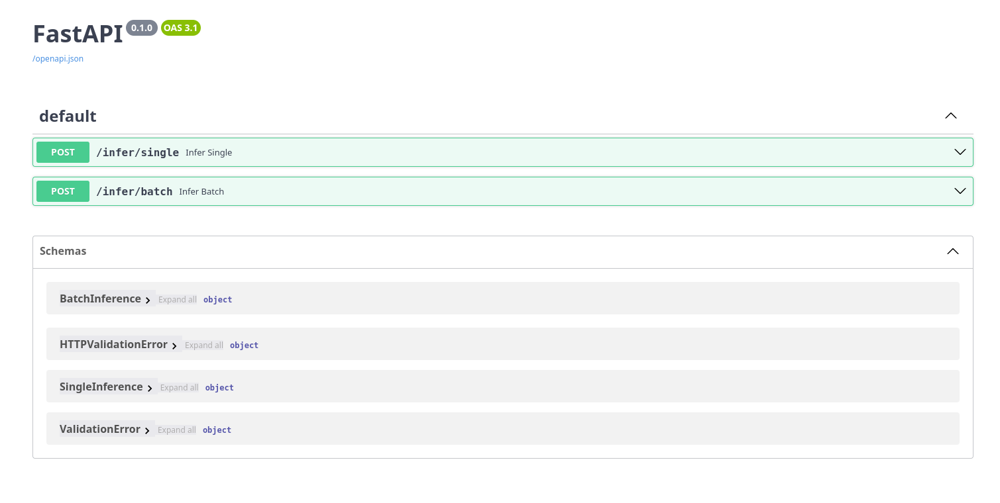

# О! Хакатон — eivankin – Тегирование тарифов

>
> Описание трека:
> - [Тегирование тарифов](https://docs.ostrovok.tech/s/hackathon-track-2)
>

## Описание решения

### Работа с данными

При рассмотрении данных были выявлены проблемы, основная из которых - плохое покрытие редких классов
или даже их полное отсутствие в данных. Для компенсации этого было сгенерировано немного новых
примеров с помощью LLM. В промптах использовались примеры исходных данных и информация об атрибутах
из условия задания. Подробнее про исследование и подготовку данных можно прочитать в
ноутбуках `01_eda.ipynb` и `02_data_preparation.ipynb`.

### Сам алгоритм

Глядя на данные была выдвинута гипотеза, что с этой задачей способны справится простые классические
модели. Для каждого предсказываемого атрибута был обучен свой классификатор, результаты оценки
которых представлены ниже:

#### Сравнение рассмотренных моделей (F1 Macro)

| Classifier                                | class | quality | bathroom | bedding | capacity | club | balcony | view |
|-------------------------------------------|-------|---------|----------|---------|----------|------|---------|------|
| DummyClassifier(strategy='stratified')    | 0.07  | 0.05    | 0.25     | 0.20    | 0.14     | 0.50 | 0.50    | 0.03 |
| DummyClassifier(strategy='most_frequent') | 0.06  | 0.03    | 0.25     | 0.15    | 0.11     | 0.50 | 0.49    | 0.03 |
| ComplementNB()                            | 0.80  | 0.89    | 0.53     | 0.38    | 0.59     | 0.55 | 0.71    | 0.65 |
| RidgeClassifier()                         | 0.97  | 0.94    | 0.91     | 0.51    | 0.83     | 0.83 | 0.96    | 0.80 |
| LinearSVC()                               | 0.99  | 0.98    | 0.99     | 0.63    | 0.89     | 0.89 | 0.98    | 0.90 |

В качестве бейзлайна использовался `DummyClassifier` с разными стратегиями. Остальные модели
значительно его превзошли. Лучшей моделью оказался `LinearSVC`. Окончательное решение о финальной
модели было принято на основе как и значений метрик, так и скорости работы.

Ниже представлены замеры скорости двух лучших моделей на rates_dirty.csv:

```
Количество записей: 180443

Сравнение через запуск CLI, включает время на чтение и загрузку моделей:
- SVC: 6.93 секунды при пропускной способности 26024.08 записей в секунду.
- Ridge: 7.03 секунды при пропускной способности 25684.03 записей в секунду.

Сравнение вне скрипта (модели и данные загружены предварительно):
- SVC: 5.15 секунды при пропускной способности 35051.44 записей в секунду.
- Ridge: 5.28 секунды при пропускной способности 34196.71 записей в секунду.
```

Подробнее с процессом обучения можно ознакомится в `03_preprocessing_and_training.ipynb`. Процесс
выбора финальной модели описан в `04_evaluation.ipynb`.

## Как запускать

### Через докер (как в sanity check action)

1. Собрать контейнеры: `docker-compose build`
2. Запустить: `docker compose run -v ${PWD}/data:/opt/data app --content=/opt/data/sanity_check_in.csv > result.csv`

### Вне контейнера

Сначала нужно установить зависимости через `poetry install --only=main`

```shell
python -m cli_app
```

### Подробнее про CLI



Приложение принимает путь к CSV-файлу с данными в качестве обязательного аргумента.

При запуске можно выбрать другой классификатор. По умолчанию выбран `LinearSVC`.

### Работа с веб-приложением



Веб-приложение будет доступно по адресу: `http://localhost:80/` после запуска соответствующего
контейнера через `docker compose up`. Документация будет доступна по
адресу: `http://localhost:80/docs/`. Через API можно
получить предсказания как для одной записи, так и для батча из 2-х и более.

## Другие комментарии

### Структура проекта

- `notebooks`: ноутбуки, затрагивающие подготовку данных, обучение и сравнение моделей, а так же
  выбор финальной.
- `model`: функции для работы с сохранёнными моделями.
- `models`: сохранённые модели в формате `joblib`.
- `raw_data`: исходные данные задачи.
- `preprocessed_data`: результаты обработки (чистки, объединения и т.д.) данных.
  Файл `augmented_merged.csv` содержит итоговый датасет, использованный для обучения и валидации.
- `preprocessed_data/few_shot`: примеры из исходной выборки, использованные для генерации
  синтетических данных.
- `preprocessed_data/generated`: синтетические данные, сгенерированные LLM для расширения исходной
  выборки.
- `web_app`: директория исходников для запуска веб-приложения.
- `cli_app.py`: консольное приложение для выдачи предсказаний предложенным алгоритмом.

